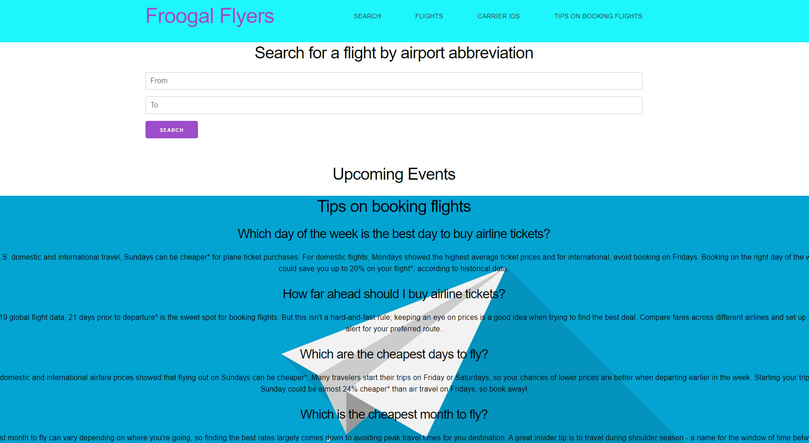

# Project 1 - Froogal Flyers

## User Story
Who is the audience?
Budget Travelers
Adventure seekers (busy-body)
Families

What is the problem that the product will address?
Select destinations
Minimize hassle of finding cheap flights and events
Provide activities while in a new place

How does the product sole that problem?
One-stop shop
Connects activities to flights (plans within flight schedule)

## Acceptance Criteria

Use a CSS framework other than Bootstrap.

Be deployed to GitHub Pages.

Be interactive (i.e: accept and respond to user input).

Use at least two server-side APIs.

Does not use alerts, confirms, or prompts (use modals).

Use client-side storage to store persistent data.

Be responsive.

Have a polished UI.

Have a clean repository that meets quality coding standards (file structure, naming conventions, follows best practices for class/id-naming conventions, indentation, quality comments, etc.).

Have a quality README (with unique name, description, technologies used, screenshot, and link to deployed application).

## Grading Requirements

This project is graded based on the following criteria:

Technical Acceptance Criteria: 25%

Satisfies the following code requirements:

Application uses at least two server-side APIs.

Application uses client-side storage to store persistent data.

Application doesn't use JS alerts, prompts, or confirms (uses modals instead).

Application uses a CSS framework other than Bootstrap.

Application is interactive (accepts and responds to user input).

Concept 10%

Application should be a unique and novel idea.

Your group should clearly and concisely articulate your project idea.

Deployment: 20%

Application deployed at live URL and loads with no errors.

Application GitHub URL submitted.

Portfolio at live URL submitted, featuring project.

Repository Quality: 10%

Repository has a unique name.

Repository follows best practices for file structure and naming conventions.

Repository follows best practices for class/id-naming conventions, indentation, quality comments, etc.

Repository contains multiple descriptive commit messages.

Repository contains quality README file with description, screenshot, and link to deployed application.

Application Quality: 15%

Application user experience is intuitive and easy to navigate.

Application user interface style is clean and polished.

Application is responsive.

Presentation 10%

Your group should present using Powerpoint or a similar presentation software.

Every group member should speak during the presentation.

Your presentation should follow the Project Presentation Template.

Collaboration 10%

There are no major disparities in the number of GitHub contributions between group members.

## Contributing Members
* JavaScript - Matthew Barry, Calvin Donner
* CSS - Gabriel Garcia, Matthew Barry, Logan Boyd
* HTML - Logan Boyd, Calvin Donner, Gabriel Garcia, Brandon Franks
## Screenshot

## APIs used
* SkyScanner - Used for flight pricing

## Website Link
https://jazzmbarry.github.io/project-1/

## CSS Frame
* Milligram - A minimalist CSS framework
